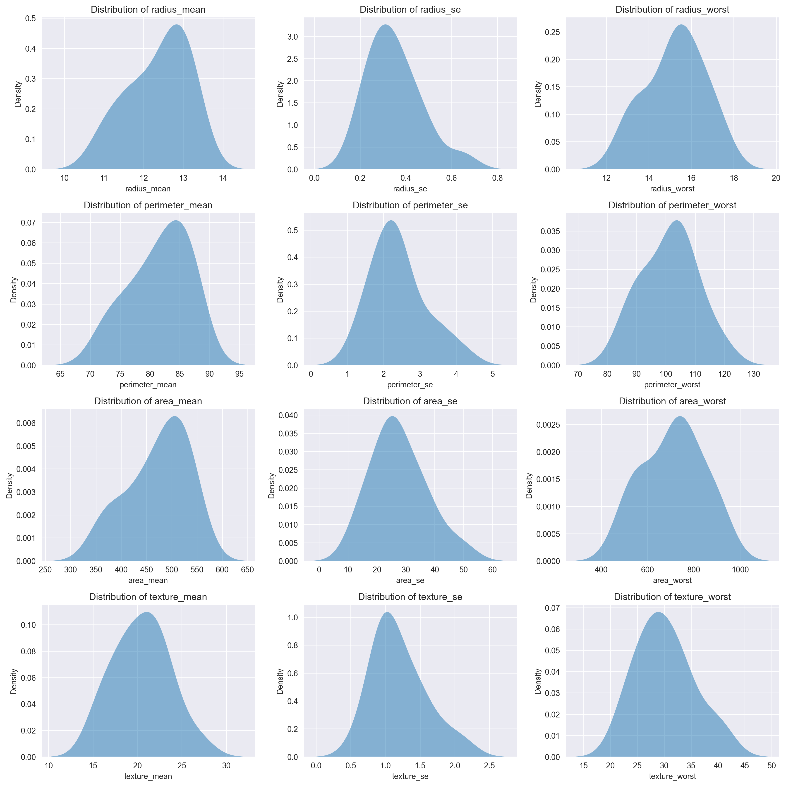
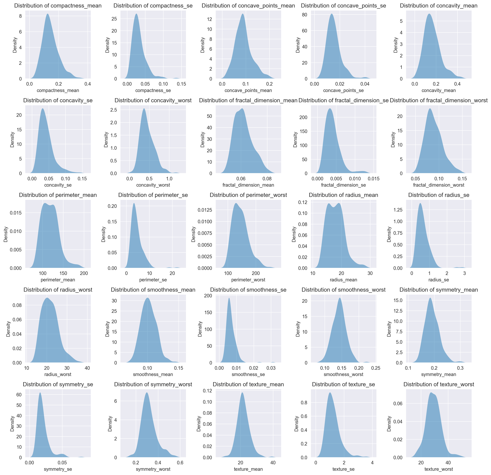
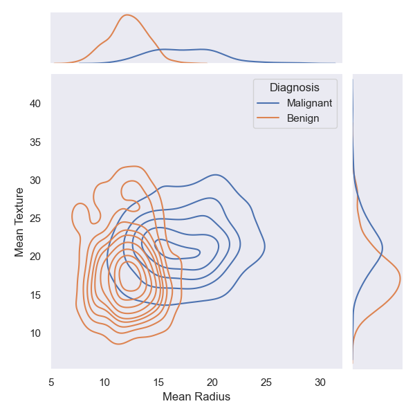
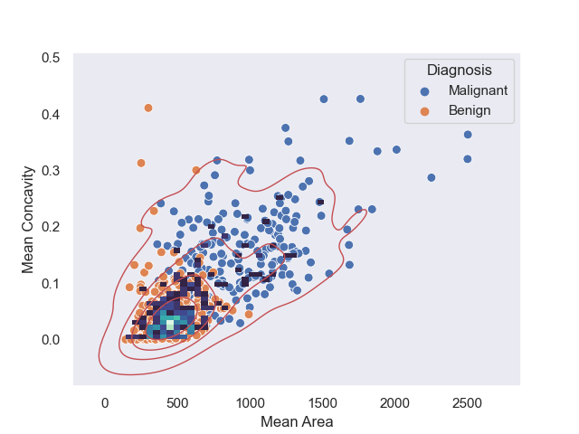
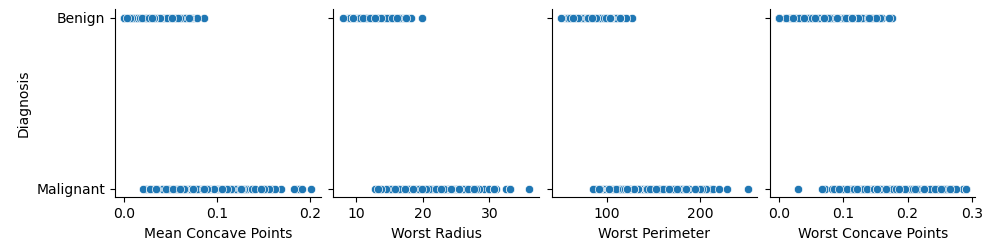
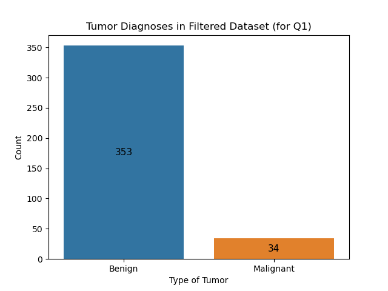
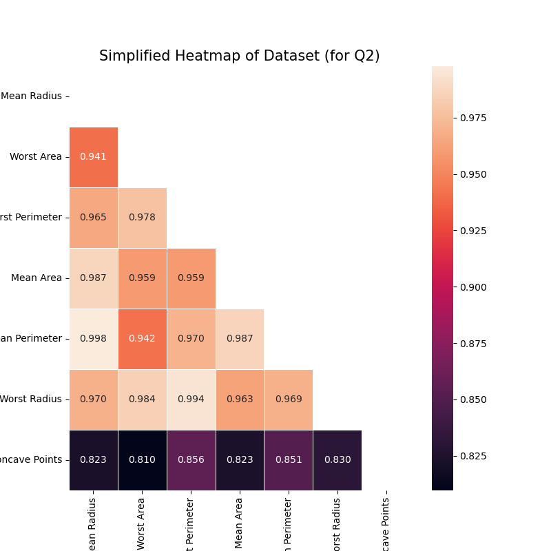
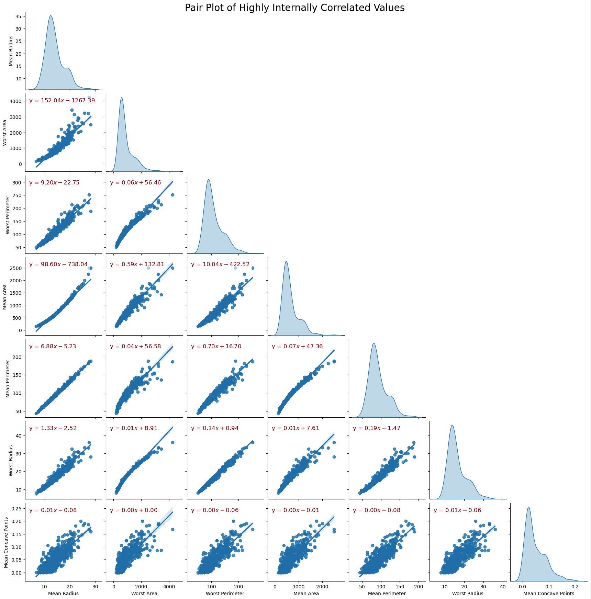

# Group 24 - Breast Cancer Diagnosis in the State of Wisconsin

## Introduction

The Breast Cancer Wisconsin Diagnostic Data Set consists of measurements of breast cancer cases that Dr. William H. Wolberg, a medical professional at the University of Wisconsin Hospitals, Madison, gathered to study trends between benign and malignant cancers. The data set has a diagnosis label of either benign (B) or malignant (M) for 569 cases in 32 data columns produced from digital images of an FNA of a breast lump. For more information, the dataset can be accessed by clicking [here](https://archive.ics.uci.edu/ml/datasets/Breast+Cancer+Wisconsin+%28Diagnostic%29).

A common and deadly disease, breast cancer affects countless people worldwide. Early detection of breast cancer is essential for successful treatment and a better prognosis. Our project examines and demonstrates the relationships between particular breast tumour characteristics and whether they are classified as malignant or benign. We hope to understand better the factors affecting benign or malignant tumour growth by identifying the most important ones. We're passionate about this topic because we want to improve early detection and look into how our findings might affect clinical decision-making. Ultimately, we hope patients, healthcare workers, and the medical community will significantly benefit from our efforts better to understand the connections between tumour traits and diagnosis.

## Team Members

- Mithish Ravisankar Geetha
- Yash Kumar
- Rajveer Sodhi

## Exploratory Data Analysis

1. Our dataset contained many more benign cases than malignant ones, as illustrated by the count plot below.
   
2. The histograms below highlighted that most variables display a right-skewed distribution. This observation implies that more data points are clustered towards the lower end of the range for these variables. In contrast, fewer data points extend toward the higher values. Notably, the 'symmetry_mean' variable is an exception, as it resembles a normal distribution, signifying a more evenly distributed set of data points around the average value.
   
3. Upon examining the heatmap, it became clear that several variables displayed high correlation values equal to or greater than 0.75. Apart from the apparent strong correlation between the 'perimeter' and 'area' variables, it's also important to highlight the significant relationship shared by the 'compactness,' 'concavity,' and 'concave points' variables. These high correlations suggested these features will likely change in tandem.
   
4. The below box plots indicated a couple of things. First, the 'mean' values are more dispersed than the 'se' and 'worst' values, implying that the 'mean' values have a more significant variation and aren't tightly clustered around a single number. Second, the 'perimeter' and 'area' values show a substantial spread, meaning they don't center around a particular value.
   
5. As indicated above, there is a considerable variation in the values of 'perimeter' and 'area.' It's essential to recognize that this variation mainly occurs in malignant cases. In contrast, benign cases concentrate on a particular value.\
   This trend is consistent across all features studied. In each case, malignant diagnoses display a more comprehensive range of values when compared to benign diagnoses.
   
6. The regression plot below indicated that, in contrast to the 'mean' and 'worst' values, the 'se' values generally cluster around a common value, with just a handful of outliers straying from this trend. Additionally, the 'concave points' and 'concavity' variables demonstrate a high correlation, regardless of the specific statistic applied. The above heatmap further corroborated this substantial relationship, solidifying the close connection between these two variables.
   

7. Based on the jointplot below, we can see that malignant cases have a higher mean radius value compared to benign cases.

## Yash Kumar

**How do the distributions of features vary across different sizes of tumours for malignant cases? More specifically, how does the importance of features vary with the tumour size for malignant diagnoses? Lastly, can we determine a range of values for which there is a high probability of a malignant diagnosis?**

I began by separating the dataset into two halves based on each case's tumour size.

- Tumors Smaller than the Median Size

Upon closely examining the critical parameters determined through thorough analysis in my notebook, it becomes evident that malignant cases tend to cluster around a specific value for these critical parameters. This observation has significant implications, suggesting a higher likelihood of cancer when a patient's parameter falls within this range.

Furthermore, for smaller tumours, I established a range for each critical parameter with a high probability of a cancer diagnosis. Specifically, if the tumour is small in size and the values for the parameters fall within the corresponding range, there is a high likelihood that the patient has cancer. To determine this, I utilized the fact that the distribution for each critical parameter is nearly bell-shaped. Therefore, by calculating the range's middle 50%, I accounted for approximately 70% of the data (tumours) since this central range encompasses most cases.

| Parameter       | Range            |
| --------------- | ---------------- |
| radius_mean     | 11.8 to 13.0     |
| radius_se       | 0.2871 to 0.4053 |
| radius_worst    | 14.49 to 16.23   |
| perimeter_mean  | 77.93 to 85.42   |
| perimeter_se    | 1.897 to 2.642   |
| perimeter_worst | 92.04 to 106.2   |
| area_mean       | 432.0 to 519.8   |
| area_se         | 23.94 to 34.44   |
| area_worst      | 591.7 to 768.9   |
| texture_mean    | 18.66 to 22.33   |
| texture_se      | 0.9238 to 1.426  |
| texture_worst   | 26.5 to 33.37    |

- Tumors Larger than the Median Size

It is clear from the analysis of the parameters above that malignant cases are once again clustered tightly around a particular value. The spike in the count values for each parameter compared to the prior graphs for the tumours with the smaller size should be noted. This suggests that the likelihood that a patient has cancer increases with the size of the growth.

As done for the critical parameters for the smaller tumours, I have found a range of values for the critical parameters in which there is a high probability of a malignant tumour.

| Parameter               | Range                |
| ----------------------- | -------------------- |
| compactness_mean        | 0.109 to 0.1686      |
| compactness_se          | 0.01971 to 0.03897   |
| concave_points_mean     | 0.06553 to 0.1054    |
| concave_points_se       | 0.01161 to 0.01763   |
| concavity_mean          | 0.1114 to 0.2032     |
| concavity_se            | 0.02713 to 0.05051   |
| concavity_worst         | 0.3215 to 0.5409     |
| fractal_dimension_mean  | 0.05647 to 0.06578   |
| fractal_dimension_se    | 0.002665 to 0.00476  |
| fractal_dimension_worst | 0.07619 to 0.1005    |
| perimeter_mean          | 102.6 to 130.5       |
| perimeter_se            | 2.903 to 5.383       |
| perimeter_worst         | 124.3 to 160.5       |
| radius_mean             | 15.49 to 19.73       |
| radius_se               | 0.4157 to 0.7661     |
| radius_worst            | 18.51 to 24.15       |
| smoothness_mean         | 0.09384 to 0.1096    |
| smoothness_se           | 0.005038 to 0.007974 |
| smoothness_worst        | 0.1281 to 0.1536     |
| symmetry_mean           | 0.1737 to 0.2092     |
| symmetry_se             | 0.01454 to 0.0225    |
| symmetry_worst          | 0.2749 to 0.353      |
| texture_mean            | 19.51 to 23.81       |
| texture_se              | 0.8749 to 1.433      |
| texture_worst           | 25.73 to 32.09       |

The list of critical parameters for larger tumours is significantly longer than for smaller ones. This indicates that cases of malignant tumours with a larger size are more likely to be detected because many parameters are grouped around a single value, meaning that their range is distinct and constrained.

Following careful analysis, it can be deduced that, in malignant instances, there is a direct correlation between the size of a tumour and the distribution of its features. The number of malignant cases noticeably increases along with a more pronounced distribution of characteristics as the size of the tumour grows. Furthermore, each feature has a narrower range of values where malignant cases are more likely to appear. This finding indicates that the range of values for which malignant cases occur has significantly decreased, making it simpler to determine the malignancy of a tumour as its size increases.

Additionally, the list of critical features determined for smaller tumours varies significantly from that for larger tumours, illuminating that some features become more crucial as tumour size increases.

To conclude, for malignant cases, the distribution of features varies across different tumour sizes. In smaller tumours, critical parameters cluster around specific values, and a high probability of malignancy exists within a defined range for each parameter. As tumour size increases, the number of malignant cases rises, and the distribution of features becomes more pronounced. The range of values for malignancy narrows, making it easier to determine malignancy as tumour size grows. The list of critical features also changes, indicating that the importance of certain features varies with tumour size.

[You can also find the complete analysis here, including the code and data](https://github.com/ubco-W2022T2-data301/project-group-group24/blob/main/analysis/analysis3.ipynb).

## Mithish Ravisankar Geetha

**Based on the observations of several key features (for example radius and texture), can we accurately identify whether the tumour being benign or malignant?**

When we use a KDE counter plot to evaluate the provided jointplot, we can see that the contour plot for malignant tumours is more clustered and has a greater peak.
Moreover, the counter plot is dispersed, with the peak for benign tumours being lower.

Further examination of the marginal histograms reveals that, in contrast to benign tumours, the radius of malignant tumours is more skewed to the right (higher values).
The mean texture of benign and malignant tumours can be observed in the same way.

Furthermore, in the below plot, we can see that benign tumours are dispersed across a wider range of values, but malignant tumours are grouped towards the lower end of the concavity and area features.
This demonstrates the strong relationship between malignant tumours and benign tumours in terms of location and concavity.

We can thus conclude that it is possible to accurately identify whether a tumour is benign or malignant through several key features. Furthermore, Malignant tumours seem to have a higher radius and area, and there are more rough and asymmetric. Through the given plots, we also discovered that It is not possible to detect the type of tumour by analyzing just the area and concavity features alone.

[You can also find the full analysis here, including the code and data](https://github.com/ubco-W2022T2-data301/project-group-group24/blob/main/analysis/analysis1.ipynb).

## Rajveer Sodhi

### Question 1

**Out of all the data columns, which features seem to be the most highly correlated with the breast cancer's diagnosis, and can we define an approximate percentage probability of the breast cancer being benign or malignant based only on the values from these features?**

To see the most highly correlated features with the Diagnosis being one way or the other, I used one row from a filtered correlation matrix heatmap. This heatmap only displayed correlations of more than 0.75 with the diagnosis:

This shows that the four most highly correlated values are *Mean Concave Points*, *Worst Radius*, *Worst Perimeter*, and *Worst Concave Points*, with a correlation value of 0.777, 0.776, 0.783, and 0.794 respectively. Then, using a pairplot, we can identify the characteristics of these columns' values when the diagnosis is, say, Benign:

This shows that the tumor is categorized as "Benign" if:
- The value of *Mean Concave Points* is in the approximate range (0, 0.085)
- The value of *Worst Radius* is in the approximate range (0, 19)
- The value of *Worst Perimeter* is in the approximate range (50, 125)
- The value of *Worst Concave Points* is in the approximate range (0, 0.17)

We used this information to create a filtered dataset with values following these constraints. Out of the 387 values in that dataset, 353 were Benign and only 34 were Malignant, which means our analysis was successful, and we can say with 91.21% certainty that a tumour is going to be Benign if it follows the above constraints. Here is a visualization of the breakdown of the new dataset:

### Question 2

**Are there certain subsets of features that seem to be internally correlated? By extension, can we predict the values of other features in this subset given the value of just one?**

To answer this question, we go back to our filtered heat map and idenify groups of variables that are highly correlated to each other. All of the groups hence formed could be linked to one another, thus forming the group:

(Mean Radius, Worst Area, Worst Perimeter, Worst Radius, Mean Area, Mean Perimeter, Mean Concave Points)

Each variable in this group is highly correlated to each other. That is, the value of one of these features is very likely to accurately indicate the value of another. We can see a simplified view of their correlations in this simplified heatmap:

As for the second part of the research question, we can use the following pairplot to examine the exact mathematical dependence of each feature on one another, and hence approximate the value of other feautres (using the equations shown below) with that of just one.

[You can also find the full analysis here, including the code and data](https://github.com/ubco-W2022T2-data301/project-group-group24/blob/main/analysis/analysis2.ipynb).

## Conclusion

Through our analysis, we were able to find several patterns and correlations in the dataset which would be useful for doctors treating cancer patients. We conclude that as the tumour grows, there is a high probability for the tumour to become malignant, and this will allow doctors to predict if the tumour is malignant or benign over time. Furthermore, we have concluded that there are several features which are useful in understanding our dataset and predict if a tumour can grow to be cancerous or not. This will be helpful for doctros to give timely diagnosis and lower the likelyhood of a tumour becoming malignant. We are also able to understand different features which are correlated to each other, thereby guiding us to understand how different 